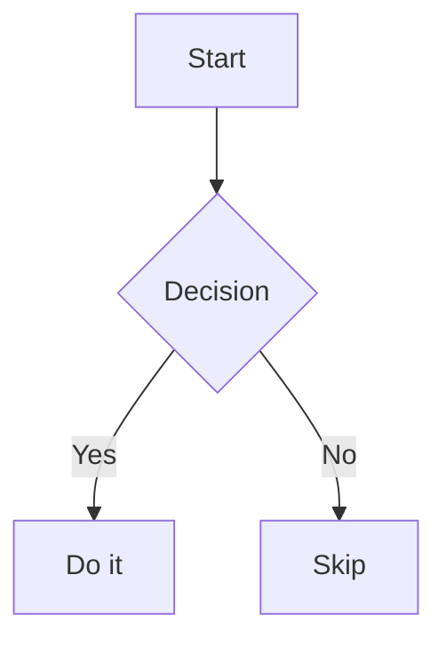

# md2pdf & pdf2md

Convert between Markdown and PDF. Includes `md2pdf` for themed PDF generation and `pdf2md` for PDF-to-Markdown extraction (with OCR fallback and optional AI cleanup).

## Installation

### Requirements

- **Node.js** (v14 or later) - [nodejs.org](https://nodejs.org/) (for md2pdf)
- **Python 3** with `pymupdf4llm` (for pdf2md)
- **pdfinfo** (optional, for page count) - usually bundled with poppler

**Optional (for image-based PDFs):**
- **tesseract** - OCR engine: `brew install tesseract`
- **pytesseract** and **Pillow** - Python bindings: `pip3 install pytesseract Pillow`
- **anthropic** - AI cleanup of OCR output: `pip3 install anthropic`

### Install

```bash
git clone https://github.com/FellowTraveler/md2pdf.git
cd md2pdf
./install.sh
```

This installs:
- `md2pdf` and `pdf2md` scripts to `~/bin/`
- Theme CSS files to `~/.md2pdf-themes/`
- Finder Quick Actions to `~/Library/Services/` (right-click context menu)

If `~/bin` is not in your PATH, the installer will show you how to add it.

### Uninstall

```bash
cd md2pdf
./uninstall.sh
```

This removes scripts, themes, and Automator workflows. **Shortcuts must be removed manually** — open the Shortcuts app, select the shortcuts you want to remove, and press Delete. macOS does not provide a way to remove Shortcuts from the command line.

## Usage

```
md2pdf - Convert Markdown to beautiful PDFs

USAGE:
    md2pdf <file.md> [theme]     Convert markdown to PDF
    md2pdf --list                List available themes
    md2pdf --help                Show this help

OUTPUT:
    Creates a PDF file with the same name as the input file.
    Example: README.md -> README.pdf

THEMES:
    academic
    claude
    dark
    executive
    github
    minimal
    modern

EXAMPLES:
    md2pdf README.md             # -> README.pdf (default: executive)
    md2pdf README.md minimal     # -> README.pdf (minimal theme)
    md2pdf docs/guide.md modern  # -> docs/guide.pdf (modern theme)
```

### Output

Creates a PDF with the same name as the input file:
- `README.md` → `README.pdf`
- `docs/guide.md` → `docs/guide.pdf`

### Examples

```bash
md2pdf README.md              # Uses default theme (executive)
md2pdf README.md minimal      # Uses minimal theme
md2pdf docs/guide.md modern   # Convert with modern theme
```

### Commands

```bash
md2pdf --list    # List available themes with descriptions
md2pdf --help    # Show help
```

### Mermaid Diagrams

Mermaid diagram blocks are automatically pre-rendered before PDF conversion:

````markdown

````

Requires `npx` (bundled with Node.js). The `@mermaid-js/mermaid-cli` package is downloaded automatically on first use via `npx`.

## Themes

| Theme | Description |
|-------|-------------|
| **executive** | Professional corporate style with navy blue accents. Default. |
| **minimal** | Clean, sparse design with maximum whitespace. |
| **academic** | Traditional serif typography for papers and articles. |
| **modern** | Contemporary tech documentation style. |
| **github** | GitHub's markdown rendering style. |
| **dark** | Dark background with light text. |
| **claude** | Claude Desktop's warm, clean aesthetic. |

Run `md2pdf --list` for detailed theme descriptions.

## Custom Themes

Add your own CSS files to `~/.md2pdf-themes/` and they'll appear in the theme list.

## pdf2md

Convert PDF files to Markdown. Handles both text-based and image-based (scanned) PDFs.

```
pdf2md - Convert PDF files to Markdown

USAGE:
    pdf2md <file.pdf>     Convert PDF to Markdown
    pdf2md --help         Show this help

OUTPUT:
    Creates a Markdown file with the same name as the input file.
    Example: README.pdf -> README.md
```

### How It Works

1. **Text extraction** — Uses `pymupdf4llm` to extract text and formatting directly from the PDF.
2. **OCR fallback** — If no text is found (image-based/scanned PDFs), falls back to `tesseract` OCR.
3. **AI cleanup** (optional) — If `ANTHROPIC_API_KEY` is set, sends output to Claude to clean up duplicates, fix artifacts, and restore markdown formatting.
4. **Image extraction** (optional) — If `ANTHROPIC_API_KEY` is set, extracts embedded images and uses Claude vision to classify each one:
   - **Technical diagrams** (flowcharts, sequence diagrams, etc.) — saved as `<name>_p<page>_img<n>.png` alongside the `.md` file, and also converted to a `\`\`\`mermaid` block in the output
   - **Other images** (photos, screenshots, etc.) — saved as `<name>_p<page>_img<n>.png` and referenced with `` in the output

### Examples

```bash
pdf2md document.pdf              # -> document.md
pdf2md scanned-doc.pdf           # OCR + optional AI cleanup
```

### AI Cleanup for OCR

OCR output from scanned PDFs is often messy (duplicated content, garbled text, lost formatting). Setting `ANTHROPIC_API_KEY` enables automatic cleanup via Claude Haiku.

**Option 1: Environment variable** (works from terminal)

```bash
export ANTHROPIC_API_KEY="sk-ant-..."
pdf2md scanned-doc.pdf
```

**Option 2: Config file** (works everywhere, including Finder Quick Actions)

```bash
mkdir -p ~/.config/pdf2md
echo 'export ANTHROPIC_API_KEY="sk-ant-..."' > ~/.config/pdf2md/env
```

Both methods work. The config file is recommended because it also works when pdf2md is invoked from Finder Quick Actions, which don't have access to your shell environment variables.

Without the API key, pdf2md still works — you just get the raw OCR output with a tip about enabling cleanup.

## Convert Audio File to Markdown Transcript

Right-click any audio file in Finder → Quick Actions → **Convert Audio File to Markdown Transcript**

Transcribes the audio and saves a `.md` file with the same name next to the original. Select multiple files to batch-transcribe. **No API keys or accounts required** — works out of the box using a local Whisper model.

**Supported formats:** `.aac`, `.mp3`, `.m4a`, `.wav`, `.ogg`, `.flac`, `.opus`, `.wma`, `.caf`

### How it works

Whisper always runs locally first. If you've set up optional keys, speaker detection runs locally via pyannote — and ElevenLabs is only called if multiple speakers are found. Single-speaker recordings always produce clean raw prose.

| Setup | What you get |
|---|---|
| Nothing (default) | Raw transcript via local Whisper — no signup, no cost |
| `HUGGINGFACE_TOKEN` | Automatic speaker identification, still fully local |
| `HUGGINGFACE_TOKEN` + `ELEVENLABS_API_KEY` | ElevenLabs used only when multiple speakers are detected |

### Optional: speaker identification

Skip this if you just want a plain transcript. Only needed if you record conversations with multiple people and want them labeled by speaker.

1. Create a free account at [huggingface.co](https://huggingface.co)
2. Get a token at <https://huggingface.co/settings/tokens>
3. Accept model terms (while signed in) at:
   - <https://huggingface.co/pyannote/speaker-diarization-3.1>
   - <https://huggingface.co/pyannote/segmentation-3.0>
4. Add to `~/.config/md2pdf/.env`:
   ```
   HUGGINGFACE_TOKEN=hf_your_token_here
   ```

### Optional: ElevenLabs cloud transcription

Skip this unless you want higher-quality transcription on multi-speaker recordings. ElevenLabs is never called for single-speaker audio.

1. Create an account at [elevenlabs.io](https://elevenlabs.io)
2. Get your API key at <https://elevenlabs.io/app/settings/api-keys>
3. Add to `~/.config/md2pdf/.env`:
   ```
   ELEVENLABS_API_KEY=sk_your_key_here
   ```

## Create Audio Narration

Right-click any `.md` file in Finder → Quick Actions → **Create Audio Narration**

Converts a Markdown file to an MP3 audio narration saved next to the original. Works out of the box using the macOS system voice — no API keys required.

**Supported input:** `.md` files only. Running on other file types shows an error dialog.

### How it works

Each time you run the action, two dialogs appear:

1. **Narration style** — Choose between:
   - *Exact transcript* — narrates the document word for word (markdown formatting stripped)
   - *Summary narration* — uses an LLM to condense the document before narrating (requires an LLM API key)

2. **Voice** — Choose from a curated list of ElevenLabs voices, macOS system voice, or search ElevenLabs for any voice by name

Output is saved as `<filename>.mp3` next to the source file.

### Optional: ElevenLabs TTS

For higher-quality narration, add an ElevenLabs API key:

1. Get a key at <https://elevenlabs.io/app/settings/api-keys>
2. Add to `~/.config/md2pdf/.env`:
   ```
   ELEVENLABS_API_KEY=sk_your_key_here
   ELEVENLABS_VOICE_ID=0hh7H4ZVAtaGpm1VZyEN   # David (default)
   ```

Or re-run `./install.sh` to configure interactively.

### Long documents

Long Markdown files are automatically split into chunks and concatenated — no manual splitting needed. Requires `ffmpeg` (`brew install ffmpeg`).

## Finder Quick Actions

The installer adds right-click context menu actions for macOS Finder:

- **Convert MD to PDF** — Right-click any `.md` file to convert it to PDF
- **Convert PDF to MD** — Right-click any `.pdf` file to convert it to Markdown
- **Copy File Contents** — Copy a file's contents to the clipboard (text files as text, images as images, PDFs/binaries as file references)
- **Copy Path** — Copy the full path of any file or folder
- **New Text File Here...** — Right-click a folder to create a new text file inside it
- **New Text File Next To This...** — Right-click any file or folder to create a new text file next to it
- **Open Folder with VS Code** — Open a folder in Visual Studio Code
- **Open Folder with Cursor** — Open a folder in Cursor
- **Open Folder with Windsurf** — Open a folder in Windsurf
- **Open Folder with Fork** — Open a folder in Fork (git client)
- **Create Audio Narration** — Right-click any `.md` file to generate an MP3 narration. Uses ElevenLabs TTS if an API key is configured, or macOS system voice as a local fallback.

On older macOS, these appear under **Services** in the Finder right-click menu. On modern macOS (Sequoia+), the installer offers to install them as **Shortcuts**, which appear under **Quick Actions** in the right-click menu. You can selectively choose which actions to install.

### Shortcuts Setup (Sequoia+)

After the installer finishes, complete these steps:

1. Open the **Shortcuts** app → **Settings** (Cmd+,) → **Advanced** → check **Allow Running Scripts**
2. **Restart your Mac** — macOS requires a restart for newly installed shortcuts to appear in Finder's Quick Actions menu
3. Right-click any file or folder in Finder → **Quick Actions** → **Customize...** → toggle on the actions you want

You can safely enable all of them — macOS automatically shows only the relevant shortcuts based on what you right-click (folder-only actions appear for folders, PDF actions appear for PDFs, etc.).

The first time you run each shortcut, macOS will ask for permission to run a script. Click **Always Allow** to avoid being asked again.

### Known Limitations

- **Folder-only actions** (like "Open Folder with VS Code") only appear when right-clicking folders, even though they show in the Customize list for all contexts.
- **Convert MD to PDF** and other file actions may appear for all file types in the Quick Actions menu. macOS Shortcuts does not support filtering by file extension — only by broad categories (files, folders, PDFs, images, etc.). The scripts handle incorrect file types gracefully.
- **Convert PDF to MD** is restricted to PDF files only via the `WFPDFContentItem` content class.
- **Removing Shortcuts** must be done manually — open the Shortcuts app, select the shortcuts, and press Delete. macOS does not provide a way to remove Shortcuts from the command line.

## Author

- Chris Odom - [GitHub](https://github.com/fellowtraveler)
- Contact: [chris@texasfortress.ai](mailto:chris@texasfortress.ai)
- [Become a sponsor for Chris](https://github.com/sponsors/fellowtraveler)
- [](https://tip.md/FellowTraveler)

## License

MIT
