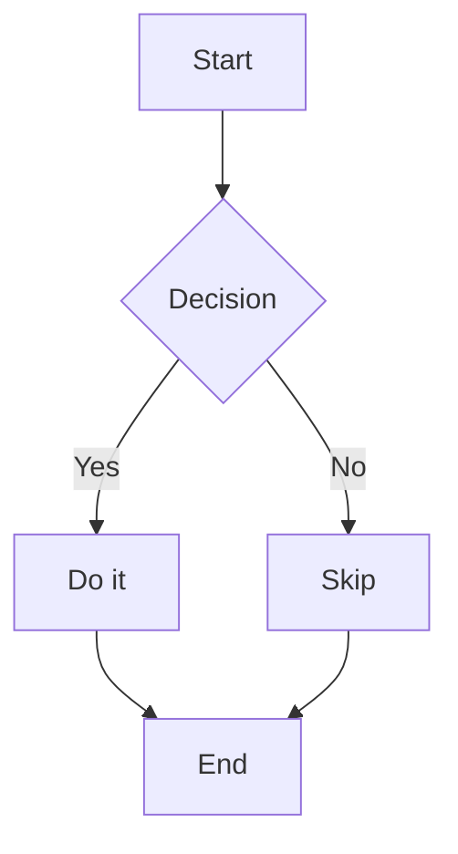

# Mermaid Diagram Support Implementation Plan

> **For Claude:** REQUIRED SUB-SKILL: Use superpowers:executing-plans to implement this plan task-by-task.

**Goal:** Add mermaid diagram rendering to md2pdf (MD→PDF) and diagram detection/conversion to pdf2md (PDF→MD).

**Architecture:** md2pdf pre-renders `\`\`\`mermaid` blocks to SVG via `mmdc` before passing to `md-to-pdf`. pdf2md extracts embedded images from the PDF with `pymupdf`, classifies each with Claude vision, saves all as image files, and additionally converts diagrams to mermaid blocks.

**Tech Stack:** `@mermaid-js/mermaid-cli` (via npx), `pymupdf` (already a transitive dep of `pymupdf4llm`), `anthropic` Python package (already installed).

---

## Task 1: MD→PDF — Mermaid pre-rendering

**Files:**
- Modify: `md2pdf` (lines 104–149)

The `md2pdf` script currently calls `npx md-to-pdf "$INPUT_FILE"` directly. We need to:
1. Add a Python pre-processing block that finds `\`\`\`mermaid` blocks, renders each to SVG via mmdc, and writes a modified markdown to a temp file
2. Use the temp file (instead of INPUT_FILE) as the source for md-to-pdf
3. Handle the output path (the temp markdown file has a different path than the input)

### Step 1: Verify mmdc works

Run: `npx --yes @mermaid-js/mermaid-cli mmdc --version`
Expected: prints a version string like `10.x.x`

### Step 2: Create a test markdown file with a mermaid diagram

Create `/tmp/test_mermaid.md`:
```markdown
# Test Mermaid

Here is a flowchart:



And some text after.
```

### Step 3: Add mermaid pre-processing to md2pdf

In `md2pdf`, **after** the block that validates the input file and theme (after line 122), and **before** the `echo` lines that print Converting/Theme/Output, add:

```bash
# Pre-process mermaid diagrams: render each ```mermaid block to SVG
MERMAID_TMPDIR=$(mktemp -d)
trap "rm -rf '$MERMAID_TMPDIR'" EXIT

PROCESSED_FILE="$INPUT_FILE"
python3 - "$INPUT_FILE" "$MERMAID_TMPDIR" << 'MERMAID_PYEOF'
import sys
import re
import os
import subprocess

input_file = sys.argv[1]
tmpdir = sys.argv[2]

with open(input_file, "r", encoding="utf-8") as f:
    content = f.read()

pattern = re.compile(r'```mermaid\n(.*?)```', re.DOTALL)
if not pattern.search(content):
    sys.exit(0)

counter = [0]

def render_block(match):
    idx = counter[0]
    counter[0] += 1
    diagram_source = match.group(1)
    mmd_file = os.path.join(tmpdir, f"diagram_{idx}.mmd")
    svg_file = os.path.join(tmpdir, f"diagram_{idx}.svg")
    with open(mmd_file, "w") as f:
        f.write(diagram_source)
    result = subprocess.run(
        ["npx", "--yes", "@mermaid-js/mermaid-cli", "mmdc",
         "-i", mmd_file, "-o", svg_file],
        capture_output=True, text=True
    )
    if result.returncode != 0 or not os.path.exists(svg_file):
        print(f"Warning: failed to render mermaid diagram {idx}: {result.stderr}", file=sys.stderr)
        return match.group(0)
    return f""

modified = pattern.sub(render_block, content)

# Write processed markdown into tmpdir with same basename so md-to-pdf names the PDF correctly
out_md = os.path.join(tmpdir, os.path.basename(input_file))
with open(out_md, "w", encoding="utf-8") as f:
    f.write(modified)

with open(os.path.join(tmpdir, "processed_path.txt"), "w") as f:
    f.write(out_md)
MERMAID_PYEOF

if [[ -f "$MERMAID_TMPDIR/processed_path.txt" ]]; then
    PROCESSED_FILE=$(cat "$MERMAID_TMPDIR/processed_path.txt")
    echo -e "${BLUE}Mermaid:${NC}   diagrams pre-rendered to SVG"
fi
```

### Step 4: Update the md-to-pdf call and output handling

Change the main conversion block. Currently it reads:

```bash
# Run md-to-pdf
npx --yes md-to-pdf "$INPUT_FILE" \
    --stylesheet "$THEME_FILE" \
    --pdf-options '{"format": "Letter", "margin": {"top": "0mm", "bottom": "0mm", "left": "0mm", "right": "0mm"}, "printBackground": true}' \
    2>&1 | grep -v "^$"

if [[ -f "$OUTPUT_FILE" ]]; then
```

Change `"$INPUT_FILE"` to `"$PROCESSED_FILE"` in the npx call. Then, because the processed file lives in MERMAID_TMPDIR, md-to-pdf will write the PDF there. Add a move step:

```bash
# Run md-to-pdf
npx --yes md-to-pdf "$PROCESSED_FILE" \
    --stylesheet "$THEME_FILE" \
    --pdf-options '{"format": "Letter", "margin": {"top": "0mm", "bottom": "0mm", "left": "0mm", "right": "0mm"}, "printBackground": true}' \
    2>&1 | grep -v "^$"

# If we used a processed temp file, move the PDF to the expected output location
PROCESSED_PDF="${PROCESSED_FILE%.md}.pdf"
if [[ "$PROCESSED_FILE" != "$INPUT_FILE" ]] && [[ -f "$PROCESSED_PDF" ]]; then
    mv "$PROCESSED_PDF" "$OUTPUT_FILE"
fi

if [[ -f "$OUTPUT_FILE" ]]; then
```

### Step 5: Run the test

```bash
md2pdf /tmp/test_mermaid.md
```

Expected output:
```
Converting: /tmp/test_mermaid.md
Theme:      executive
Output:     /tmp/test_mermaid.pdf
Mermaid:   diagrams pre-rendered to SVG
...
✓ PDF created successfully: /tmp/test_mermaid.pdf
```

Open `/tmp/test_mermaid.pdf` and verify the flowchart is rendered as a visual diagram (not raw mermaid source code).

### Step 6: Test with no mermaid blocks (regression)

```bash
echo "# Hello\n\nJust text." > /tmp/test_plain.md
md2pdf /tmp/test_plain.md
```

Expected: PDF created, no "Mermaid:" line in output. Verifies the fast-path works.

### Step 7: Commit

```bash
git add md2pdf
git commit -m "feat: pre-render mermaid blocks to SVG before PDF conversion"
```

---

## Task 2: PDF→MD — Image extraction and diagram detection

**Files:**
- Modify: `pdf2md` (lines 88–143)

The `pdf2md` script currently uses `pymupdf4llm.to_markdown(input_file, ignore_graphics=True)`. After the text extraction and LLM cleanup, we add a new phase that extracts images using `pymupdf`, classifies each with Claude vision, and inserts them into the markdown.

### Step 1: Find a test PDF with embedded images

Use any PDF that contains embedded images or diagrams. If you have the `RUST_PORT.md` mentioned earlier, first convert it: `md2pdf /Users/au/src/mfi/opentxs/RUST_PORT.md` to get a PDF with mermaid diagrams rendered as SVGs, which pdf2md will then try to detect and convert back.

### Step 2: Add image extraction phase to pdf2md

In `pdf2md`, after the LLM cleanup block (after line 234, before the final success check), add:

```bash
# Image extraction and diagram detection phase
if [[ -n "$ANTHROPIC_API_KEY" ]]; then
    echo -e "${BLUE}Extracting images from PDF...${NC}"
    python3 - "$INPUT_FILE" "$OUTPUT_FILE" << 'IMAGE_PYEOF' || true
import sys
import os
import base64

try:
    import pymupdf
    import anthropic
except ImportError as e:
    print(f"Skipping image extraction: {e}", file=sys.stderr)
    sys.exit(0)

input_file = sys.argv[1]
output_file = sys.argv[2]

base_name = os.path.splitext(os.path.basename(output_file))[0]
output_dir = os.path.dirname(os.path.abspath(output_file))

doc = pymupdf.open(input_file)
client = anthropic.Anthropic()
insertions = []

for page_num, page in enumerate(doc):
    image_list = page.get_images(full=True)
    for img_idx, img_info in enumerate(image_list):
        xref = img_info[0]
        try:
            base_image = doc.extract_image(xref)
        except Exception as e:
            print(f"  Warning: could not extract image p{page_num+1} img{img_idx+1}: {e}", file=sys.stderr)
            continue

        image_bytes = base_image["image"]
        image_ext = base_image.get("ext", "png")
        img_filename = f"{base_name}_p{page_num+1}_img{img_idx+1}.{image_ext}"
        img_path = os.path.join(output_dir, img_filename)

        with open(img_path, "wb") as f:
            f.write(image_bytes)

        media_type = "image/jpeg" if image_ext in ("jpg", "jpeg") else f"image/{image_ext}"
        img_b64 = base64.b64encode(image_bytes).decode()

        # Classify: diagram or not?
        try:
            classify_resp = client.messages.create(
                model="claude-sonnet-4-6",
                max_tokens=10,
                messages=[{"role": "user", "content": [
                    {"type": "image", "source": {"type": "base64", "media_type": media_type, "data": img_b64}},
                    {"type": "text", "text": "Is this a technical diagram (flowchart, sequence diagram, architecture chart, state machine, entity relationship diagram, etc.) that could be expressed as Mermaid syntax? Answer only 'yes' or 'no'."}
                ]}]
            )
            is_diagram = classify_resp.content[0].text.strip().lower().startswith('y')
        except Exception as e:
            print(f"  Warning: classification failed for {img_filename}: {e}", file=sys.stderr)
            is_diagram = False

        if is_diagram:
            try:
                convert_resp = client.messages.create(
                    model="claude-sonnet-4-6",
                    max_tokens=2048,
                    messages=[{"role": "user", "content": [
                        {"type": "image", "source": {"type": "base64", "media_type": media_type, "data": img_b64}},
                        {"type": "text", "text": "Convert this diagram to Mermaid syntax. Output only the raw mermaid code (no ```mermaid fences, no explanation)."}
                    ]}]
                )
                mermaid_code = convert_resp.content[0].text.strip()
                # Strip fences if LLM included them anyway
                if mermaid_code.startswith("```"):
                    lines = mermaid_code.splitlines()
                    inner = lines[1:-1] if lines[-1].strip() == "```" else lines[1:]
                    mermaid_code = "\n".join(inner)
                img_md = f"\n\n```mermaid\n{mermaid_code}\n```"
                print(f"  Diagram → mermaid: {img_filename}", file=sys.stderr)
            except Exception as e:
                print(f"  Warning: mermaid conversion failed for {img_filename}: {e}", file=sys.stderr)
                img_md = f""
        else:
            img_md = f""
            print(f"  Image saved: {img_filename}", file=sys.stderr)

        insertions.append(img_md)

doc.close()

if not insertions:
    sys.exit(0)

with open(output_file, "a", encoding="utf-8") as f:
    f.write("\n\n## Extracted Images\n\n")
    for img_md in insertions:
        f.write(img_md + "\n\n")
IMAGE_PYEOF
else
    echo -e "  ${YELLOW}Tip: Set ANTHROPIC_API_KEY for diagram detection in images${NC}"
fi
```

### Step 3: Run the test

```bash
pdf2md /tmp/test_mermaid.pdf
```

Expected output includes:
```
Extracting images from PDF...
  Diagram → mermaid: test_mermaid_p1_img1.svg
✓ Markdown created successfully: /tmp/test_mermaid.md
```

Open `/tmp/test_mermaid.md` and verify:
1. A `## Extracted Images` section appears at the bottom
2. It contains ``
3. It contains a ` ```mermaid ``` ` block with the diagram source

### Step 4: Test with a PDF without images (regression)

```bash
echo "# Just text" | npx --yes md-to-pdf - --output /tmp/text_only.pdf
pdf2md /tmp/text_only.pdf
```

Expected: no `Extracting images` phase errors, `## Extracted Images` section absent.

### Step 5: Test without API key (graceful degradation)

```bash
ANTHROPIC_API_KEY="" pdf2md /tmp/test_mermaid.pdf
```

Expected: shows the tip message, no crash, markdown still created from text extraction.

### Step 6: Commit

```bash
git add pdf2md
git commit -m "feat: extract images from PDF and convert diagrams to mermaid"
```

---

## Task 3: Update README with new capabilities

**Files:**
- Modify: `README.md`

### Step 1: Add mermaid section to md2pdf docs

In `README.md`, under the md2pdf usage section, add:

```markdown
### Mermaid Diagrams

Mermaid diagram blocks are automatically pre-rendered to SVG before PDF conversion:

\`\`\`markdown
\`\`\`mermaid
graph TD
    A[Start] --> B[End]
\`\`\`
\`\`\`

Requires `npx` (bundled with Node.js). The `@mermaid-js/mermaid-cli` package is
downloaded automatically on first use.
```

### Step 2: Add image extraction section to pdf2md docs

Under the pdf2md usage section, add:

```markdown
### Image and Diagram Extraction

When `ANTHROPIC_API_KEY` is set, embedded images are extracted from the PDF and saved
alongside the `.md` output. Images classified as technical diagrams are additionally
converted to Mermaid syntax:

- **Diagrams**: saved as `<name>_p<page>_img<n>.png` + inserted as `\`\`\`mermaid` block
- **Other images**: saved as `<name>_p<page>_img<n>.png` + inserted as `` reference
```

### Step 3: Commit

```bash
git add README.md
git commit -m "docs: document mermaid support for md2pdf and pdf2md"
```
